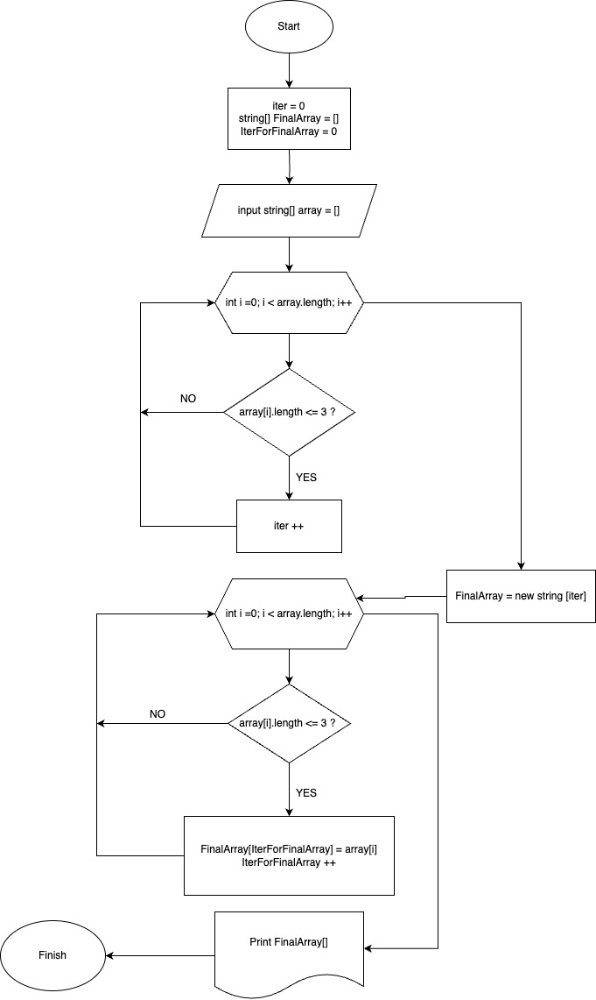

## Задача: Написать программу, которая из имеющегося массива строк формирует новый массив из строк, длина которых меньше, либо равна 3 символам

#### Описание программы

* В начале мы заводим массив с консоли
* Далее через цикл мы проходим весь массив и считаем количество элементов подходящих под условия задачи
* Создаем новый массив в котором будет столько же элементов, сколько и в прошлом подходило нам по условиям
* Далее так же через цикл мы проходим весть массив и приравниваем элементы нового массива к элементам старого, которые нам подходили по условиям. Для движения по двум массивам у нас есть 2 счетчика: один из них увеличивается при каждом обороте цикла, а второй только когда мы приравниваем элементы наших массивов
* Выводим итоговый массив

#### Алгоритм решения в блок-схеме

#### Взаимодействие с программой

###### Программа принимает N количество строк и возвращает только те которые короче 4-х символов

1. В начале программа спросит количество элементов массива, нужно числом написать сколько строк вы хотите ввести
2. Далее вы поочередно вводите строки, разделяя их переносом на следующую строку ("ENTER")
3. Программа вернет строки короче 4-х символов, последовательно, в одну линию, разделяя их пробелами
